# Mobile App

The screenshots below show how the app presents itself to the users and how the content is rendered on screen.
The UI features additional light/dark mode options, can scale content, and supports swipe commands (all screenshots were taken from an Android device with dark mode enabled).

::: info

Please note that the user interface is multi-lingual, displaying the default language of the device on which the app is installed.
All interface labels can be customized.
The language of the provided content, of course, depends on what the researchers upload to the database and is unaffected by any regional/language settings.

:::

## Normal Mode

The home screen features the feed/overview of all the content for our sample user.
It can be fully personalized.
For each item, two different preview modes are available (e.g., top screen-wide preview vs. the other square thumbnail item previews below).
Furthermore, the home screen allows users to bookmark and access items later on.
Selecting any item will then direct the user to the next screen, the detail view (in this case, the article view).

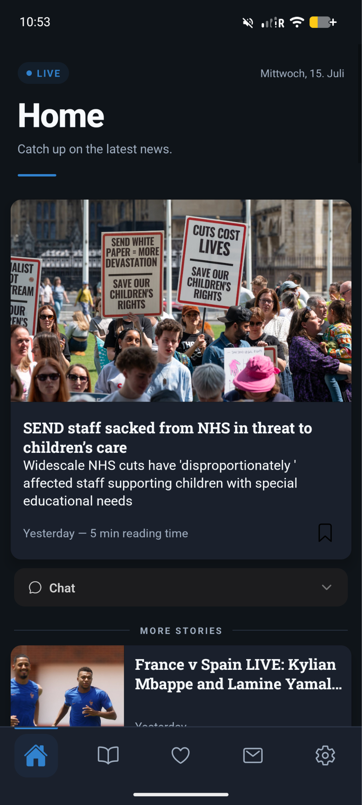

## TikTok Mode

Alongside the list-based feed above, the app offers a **TikTok mode**: articles are shown as a swipeable, full-screen list, where swiping up brings the user to the next article. Past a certain swiping distance, the next article takes over as the active card. Double-tapping an article adds it to favorites, with a heart animation confirming the action. Tapping the description expands/collapses it; tapping the image or title opens the full article.

A researcher controls which mode a user group sees from the admin website — live, without requiring an app reinstall or restart — and can schedule mode switches ahead of time (see [Experiment Scheduling](./scheduling.md)).

The card below the active one is already partially visible while swiping, which is what makes the swipe-to-advance transition feel continuous rather than a hard page cut:

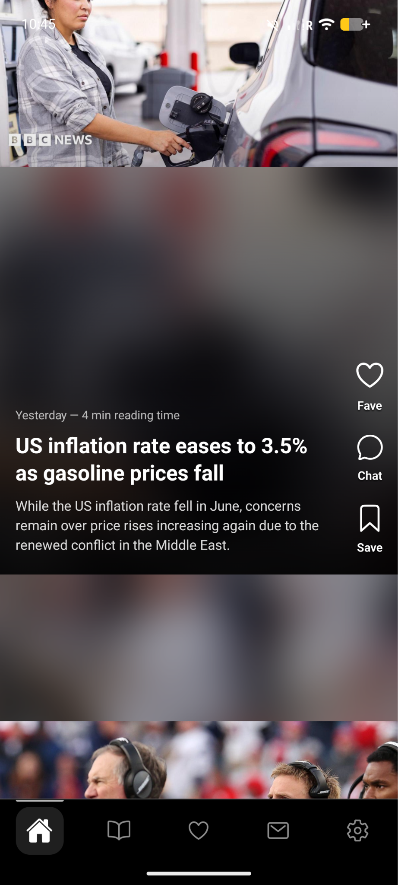

## Article View

The full article view (title, body, ratings, etc.) is shared between both modes — opening an article looks the same whether it was reached from Normal or TikTok mode. Here, users can view the full content of the item and leave a rating.
They are also able to add items to their favorite list and/or bookmark them to consume later. Scrolling down shows the optional per-article feedback questions, followed by up to five similar/related articles:

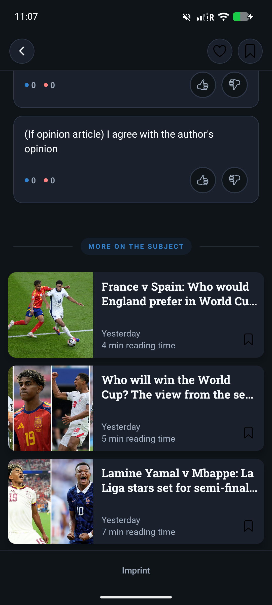

## Multimedia Articles

Both modes support not only text articles, but also podcasts and video articles. In TikTok mode, both start playing automatically once they appear in the feed.

* **Podcast articles** show a headphone icon next to the title, to differentiate them from normal text articles. Tapping on the image toggles the sound on and off. Opening the article lets the user read the full description and navigate through the podcast.
* **Video articles** are cropped to fit the vertical phone format in the feed, with the full-screen video still accessible from the full article view.

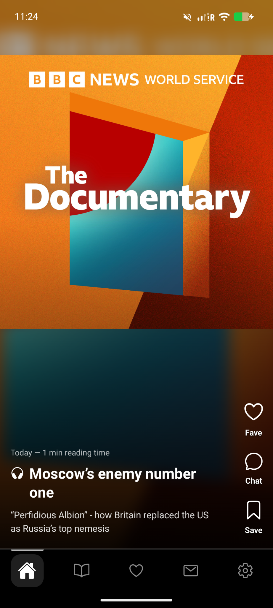
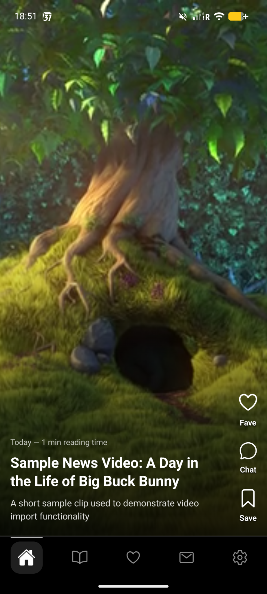

::: info
No news outlet currently scraped by the platform provides video content directly, so the video example above is a sample article used to demonstrate the feature rather than a real scraped article.
:::

## Article Rating

The app allows each user to react to and rate the item recommendations they receive.
At the bottom of each item, there are thumbs-up and thumbs-down icons (see the picture below on the left and center).
In addition to expressing their like or dislike of a certain item, experimenters can choose to either enable or disable a rating survey.
This survey enables users to provide more detailed reasons for their liking or disliking of a specific item recommendation.

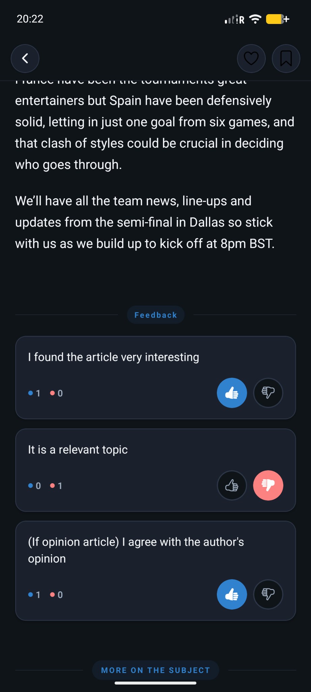

## Favorite/Bookmark List

Bookmarking or favoriting an item creates a new entry in a separate bookmark/favorite list.
Both lists look identical.
They can be accessed via the main menu (blue button in the bottom right-hand corner) in Normal mode, or via the bottom navigation bar.

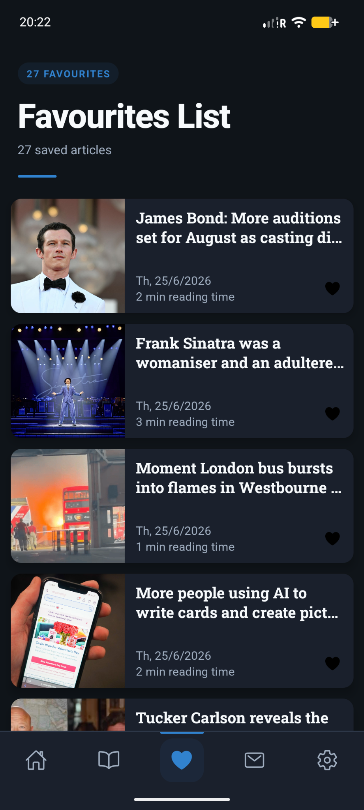
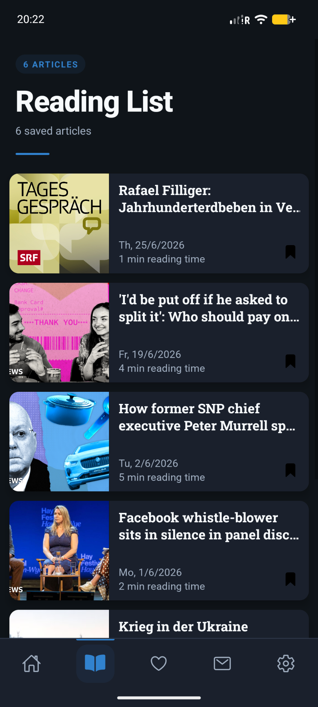

## Settings Menu

The app features a settings menu where researchers can post additional information about the experiment.
Researchers can link the *Privacy Policy*, *Terms and Conditions*, an experiment website, support email, and general information about the user study in a free-text field.
Furthermore, users can access the built-in tutorial under *Operational Manual* to learn how to navigate and use the app.
In this menu, users can also request account deletion (this is a new requirement from Google and Apple).
By default, users are forwarded to a separate URL where they can enter their username.
This is then sent to the e-mail address of the responsible researcher.

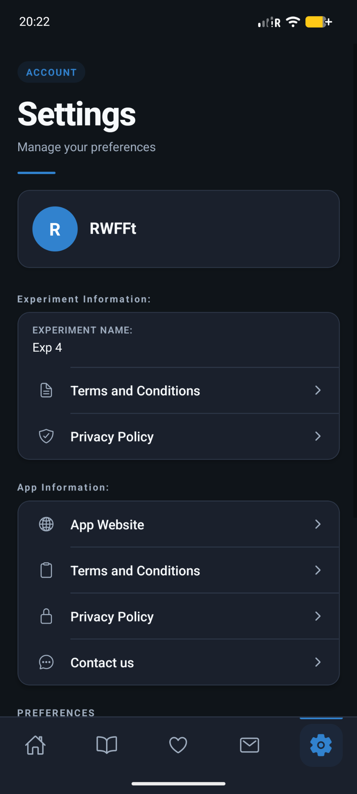
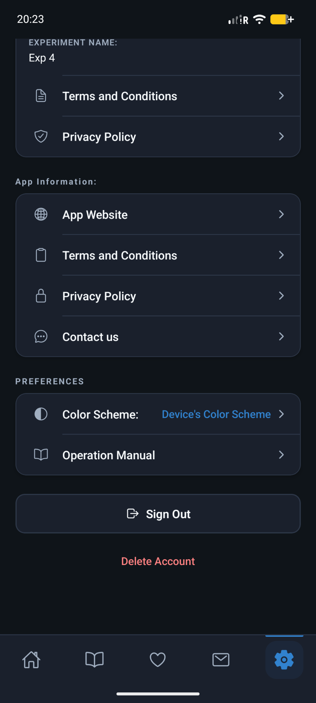

## In-app Survey

The app allows experimenters to display surveys at any point in time. A wide range of different question types is supported.
Below is an overview of how the questions are presented to participants and the available options.

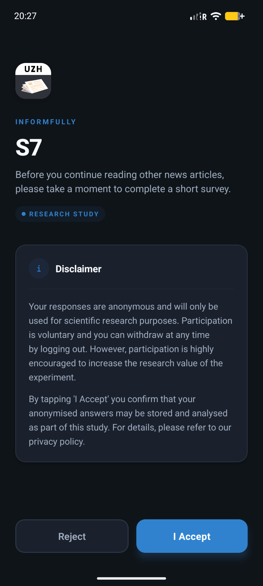
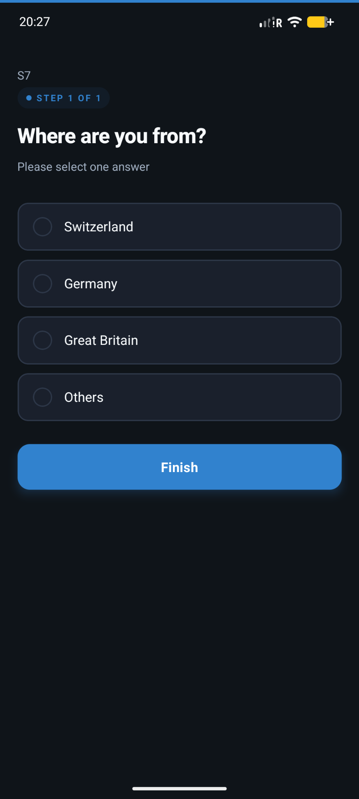

