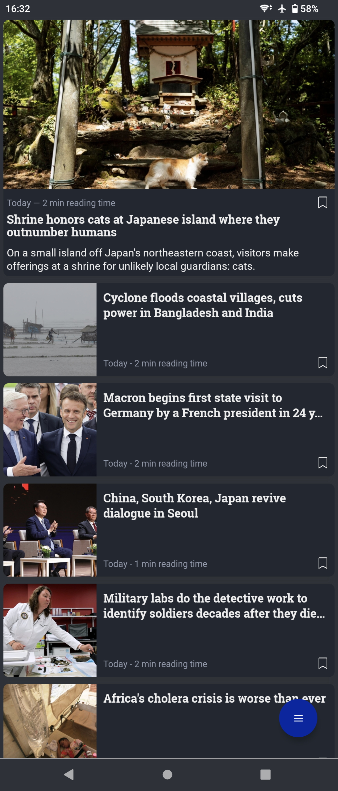
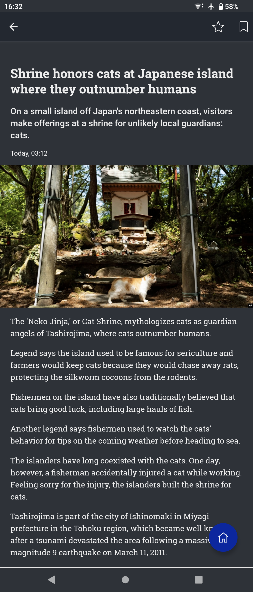
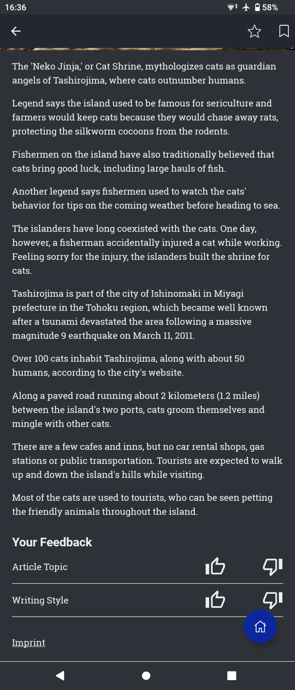
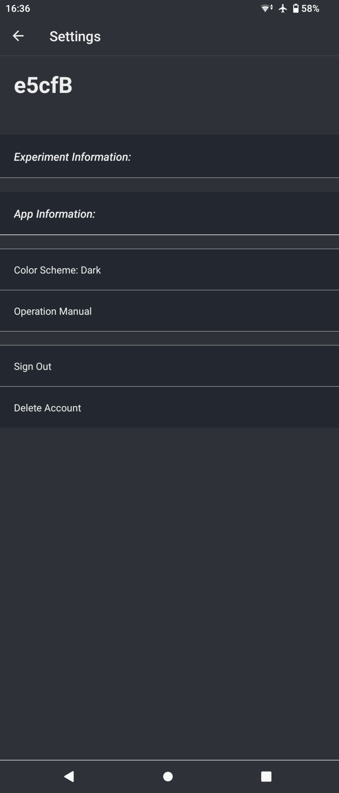
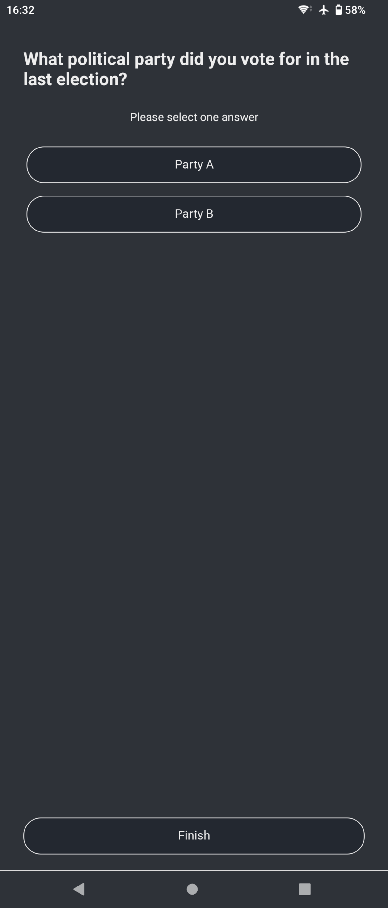

The screenshots below show how the app presents itself to the users and
how the content is rendered on screen. The UI has additional light/dark
mode features, can scale content and supports swipe commands (all
screenshots are taken from an Android device with the dark mode
enabled).

{height="720px"}

:::: note
::: title
Note
:::

Please note that the user interface here is multi-lingual, reading out
the default language of the device the app is installed on. All
interface labels can be customized. The language of the provided
content, of course, depends on what the researchers upload to the
database and is unaffected by any regional/language settings.
::::

# Home Screen

The home screen features the feed/overview of all the content for our
sample user. It can be fully personalized. For each item, two different
preview modes are available (e.g., top screen-wide preview vs. the other
square thumbnail item previews below). Furthermore, the home screen
allows items to be bookmarked and consumed later on. Selecting any item
will then bring the user to the next screen, the detail view (here,
article view).

{height="720px"}

# Article View

By selecting an item from the feed, the user then gets to the detail
view. Here, they are able to look at the full content of the item and
leave a rating. They are also able to add items to their favorite list
and/or bookmark them to consume them later on.

{height="720px"}

# Article Rating

The app allows each user to react and rate the item recommendations they
are provided with. On the bottom of each item, there are a thumbs up and
thumbs down icon (see the below picture on the left and center). In
addition to expressing their like or dislike of a certain item,
experimenters can choose to either enable or disable a rating survey.
This survey allows users to further specify what the exact reasons were
for why they liked or disliked a certain item recommendation.

{height="720px"}

# Favorite/Bookmark List

Bookmarking or favoriting an item creates a new entry in a separate
bookmark/favorite list. Both lists look identical. They can be accessed
via the main menu (blue button in the bottom right-hand corner).

{height="720px"}

# Settings Menu

The app features a settings menu where researchers can post additional
information about the experiment. Researchers can link the *Privacy
Policy*, *Terms and Conditions*, a experiment website, support e-mail,
and general information about the user study in a free text field.
Furthermore, users can assess the built-in tutorial under *Operational
Manual* in order to see how to navigate and use the app.

In this menu, users are also able to request the account deletion (this
is a new requirement from Google and Apple). By default, users are
forwarded to a separate URL where they can enter their username. This is
then sent to the e-mail address of the responsible researcher.

{height="720px"}

# In-app Survey

The app allows experimenters to display surveys at any point in time. A
wide range of different question types are supported. Below is an
overview of how the questions are presented to the participants and what
the available options are.

{height="720px"}
