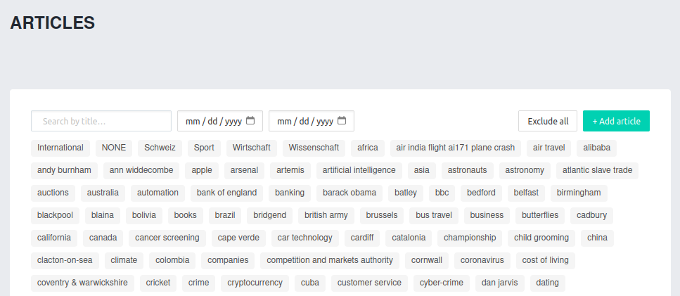
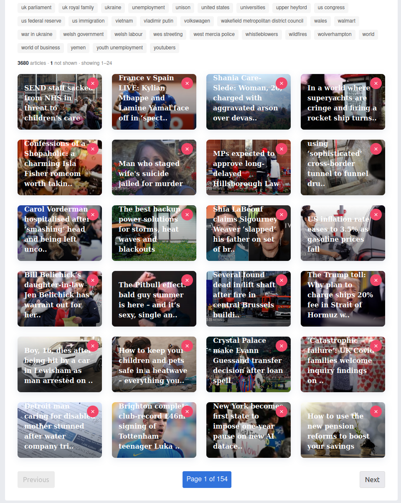
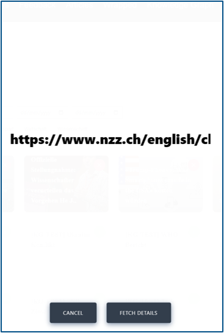
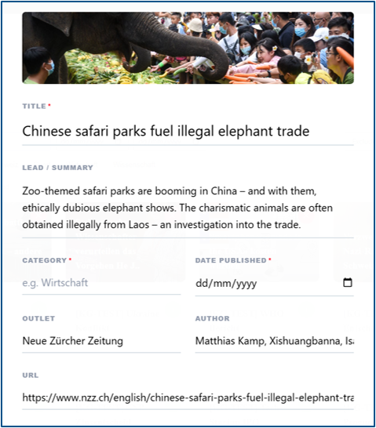

# Experiment-Scoped News Content

Originally every news article lived in a single global pool: an article uploaded for one study was visible in all of them, and researchers running concurrent studies on the same deployment could interfere with one another. As the platform started hosting several studies at once, this became a correctness problem rather than a nuisance.

Every article now carries an explicit list of the experiments it belongs to (`experimentIds`) and a `visibility` level, and duplicate-URL detection is scoped to the researcher's own articles/experiments rather than being global — see [Database Collections → newsArticles](./database.md#newsarticles) for the exact schema, and [Meteor Methods → articles](./methods.md#articles) for the methods below.

## Managing Articles

The article-management admin page lets a researcher search and filter their articles by title, date range, and category, and see how many articles are excluded vs. included:

Below the filters, a paginated grid shows every article the researcher can manage (their own articles, scoped per [`allArticlesAdmin`](./publications.md#allarticlesadmin)), with a per-article remove/exclude control:

## Adding an Article by URL

Clicking **+ Add article** opens a dialog to paste a source URL and fetch its metadata (`articles.fetchMetadata`):

The fetched title, lead, category, date, outlet, author, and URL are pre-filled into an editable form before the article is actually created (`articles.create`):

## Reusing an Article Across Experiments

Because `experimentIds` is a set, one stored article can serve several of a researcher's experiments without duplicating the document — `articles.setExperimentScope` adds or removes a single experiment from that set.

When a researcher uploads a URL that already exists **in their own scope**, an override flow (`articles.overrideContent`) lets them replace the stored article's content and attach it to a further experiment, instead of creating a duplicate or silently failing.
