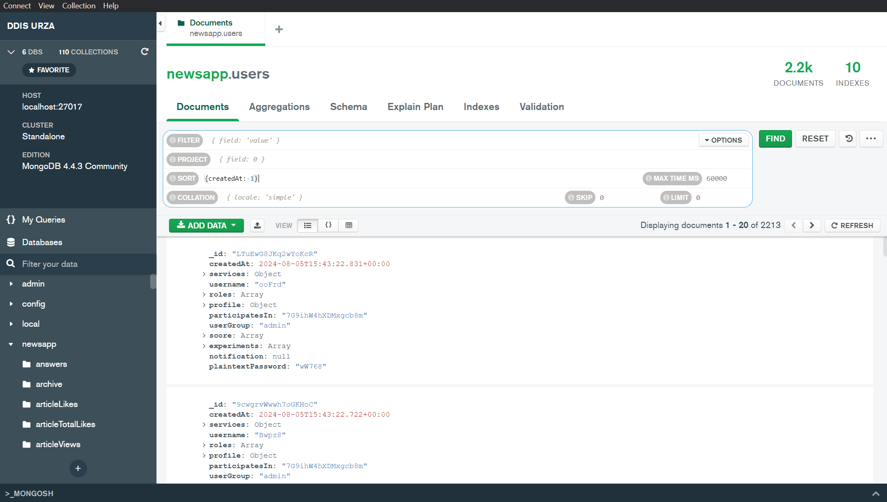
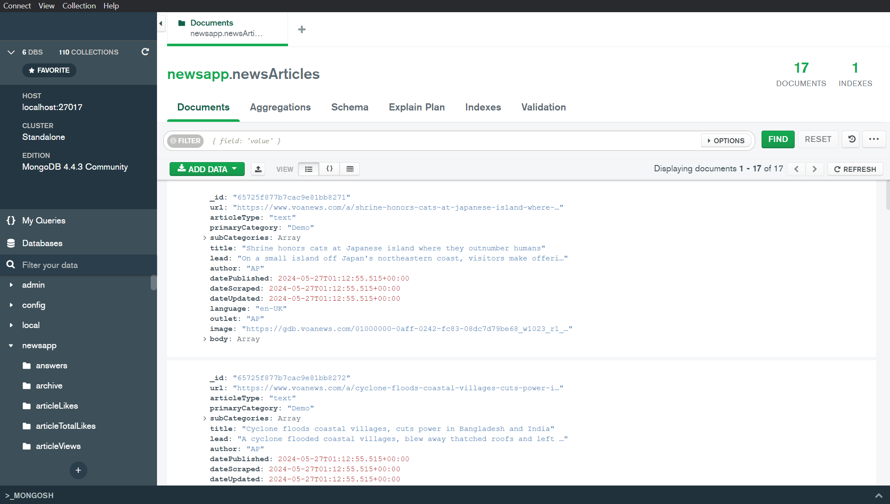
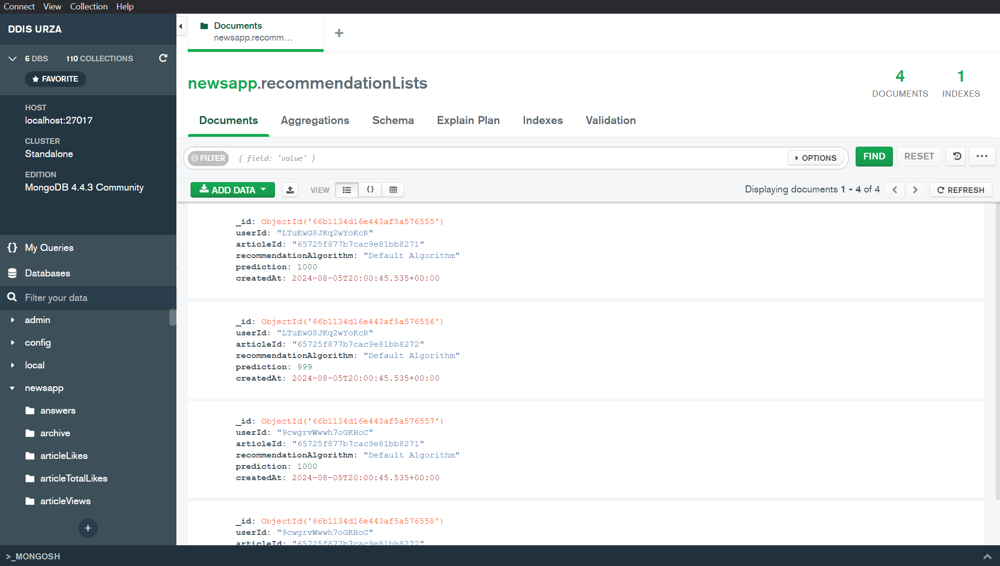

# Database Tutorial

This page provides an introduction to retrieving user and item IDs from the Informfully MongoDB back end for creating recommendation lists.
In the example shown on this page, we use [MongoDB Compass](https://www.mongodb.com/products/tools/compass) to explore the database and its collections.
(In the context of MongoDB a "table" in the database is referred to as "collection" and "entry/tupel" as "document" instead.)

To customize the recommendations displayed to users, you must edit the following collections: `users`, `items`, and `recommendations`, outlined below.
Customization of recommendation list entries is done using three steps:
* Create user accounts and retrieve their IDs
* Scrape/upload items to recommend and retrieve their IDs
* Create item recommendation lists for users

## Retrieving User IDs

`users` collection:
The first step in creating a recommendation requires extracting User IDs.
In the user collection, you can filter by e-mail address or creation date.
This allows you to retrieve the ObjectIDs of the users you have created on the [website earlier](./items.md).
Export the users and save the IDs.
We recommend you either create a custom mapping between the back end IDs and your external recommender framework or use the ObjectIDs in your framework as well.

## Retrieving Item IDs

`items` collection:
Retrieving item IDs is identical to retrieving user IDs.
Simply export the IDs you need from this collection.
Ensure that both the back end and your recommender framework use the same IDs when generating user-specific recommendation lists.

::: info

Please visit the [Item Entries](./items.md) page to see how Informfully stores recommendations.
We provide an example of a news article entry.
The collection, however, can accommodate any item and be configured to match your use case.

:::

## Creating Recommendation Lists

`recommendationLists` collection:
The final step in creating custom recommendations is to combine user IDs and item IDs.
You can add entries 1) manually via MongoDB Compass, 2) import them via the interface, or 3) add them using a script.

::: info

Please visit the [Item Visualization](./recommendations.md) page to learn how to create custom entries and forward recommendations from your external system.

:::
