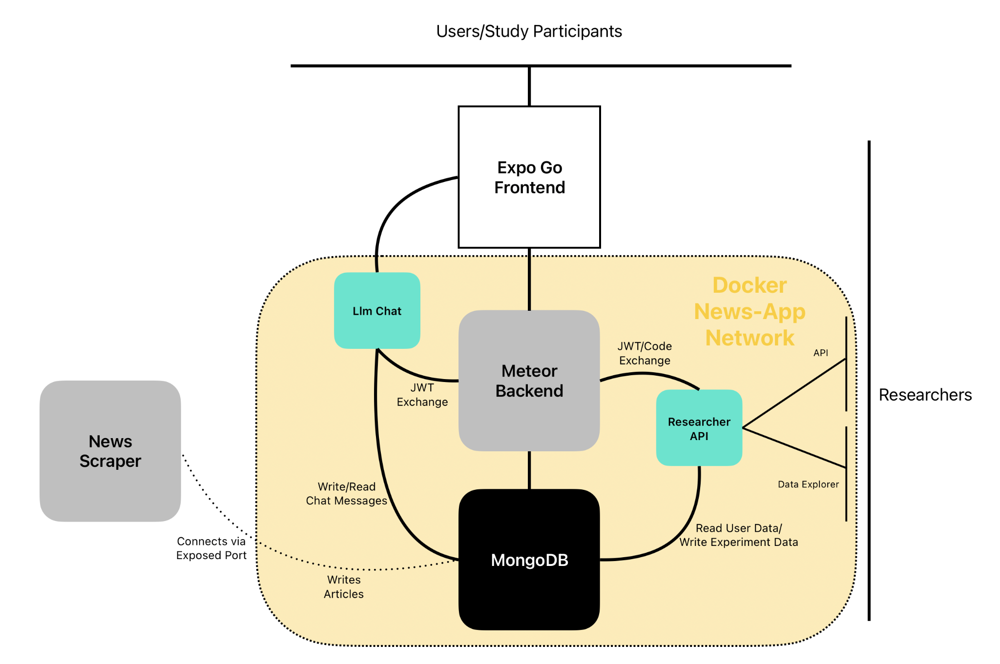

# Docker Setup

::: warning
This page describes the current `docker-compose.yml` stack. It replaces an older workflow that built two bespoke, hand-written Docker images (a Node 16 + `expo-cli` frontend image and a Phusion Passenger + manually-installed-MongoDB backend image). That approach is no longer used — only the **back end** is containerized today; the mobile app frontend runs directly via Expo (see [Local Development](./development.md)).
:::

The back end is defined as a multi-service stack in `docker-compose.yml`, with `docker-compose.override.yml` applied automatically for local development. See [Installation Instructions](./install.md) for how to configure the required `.env` file before starting these services.



The Expo frontend runs outside Docker and connects to the Meteor backend; the news scraper (also outside Docker) writes articles to MongoDB directly through an exposed port rather than going through Meteor. Everything inside the dotted line runs on one Docker network and can reach `mongo` directly.

## Services

| Service | Image / Build | Purpose | Host port(s) |
| --- | --- | --- | --- |
| `meteor` | built from `./backend` | The Meteor application server (admin website + app back end). | `8080` (compose file); `docker-compose.override.yml` additionally maps `3000:3000` for local dev. |
| `fastapi` | built from `./fastapi_app` | The [Researcher Data API](./researcher-api.md) — a Python FastAPI service exposing experiment data to researchers over REST. | `8000` |
| `llm-chat-service` | built from `./llmChatService` | Backs the experimental article chatbot feature; kept in its own container so an experimental, potentially resource-hungry feature can't destabilize the Researcher API. | `8001` (mapped to the container's `8000`) |
| `mongo` | `mongo:7` | Shared MongoDB instance used by all of the above. | `27017` |
| `caddy` | `caddy:2-alpine` | Reverse proxy terminating HTTPS and forwarding to the `meteor` service. Only started when the `proxy` [Compose profile](https://docs.docker.com/compose/profiles/) is enabled (`docker compose --profile proxy up`) — see [Back End Deployment](./deployment.md). | `80`, `443` (+ UDP 443 for HTTP/3) |

All services share a single Docker network and address each other by service name (e.g. the `meteor` and `fastapi` containers both connect to Mongo via `mongodb://mongo:27017`) — no service needs to know another's host-mapped port.

### Starting the Stack

```console
# Local development (applies docker-compose.override.yml automatically)
docker compose up -d

# Production/staging (proxy profile, no override file)
docker compose -f docker-compose.yml --profile proxy up -d
```

### The Meteor Image

`backend/Dockerfile` builds on `node:22-bookworm`, installs Meteor globally as an unprivileged `meteor` user, installs npm dependencies, and runs `meteor run --port 3000`. Named volumes (`meteor_node_modules`, `meteor_local`, `meteor_build`, `meteor_home`) persist `node_modules`, `.meteor/local`, `_build`, and the Meteor home directory across container restarts, so a plain `docker compose up` doesn't need to reinstall/rebuild everything each time.

### The Researcher API and LLM-Chat Images

Both `fastapi_app/Dockerfile` and `llmChatService/Dockerfile` build on `python:3.12-slim`, install from `requirements.txt`, and run their app with `uvicorn`. They're intentionally simple and stateless — all persistent state lives in the shared `mongo` service.

### Environment Variables

The JWT bridge secret (`API_JWT_SECRET`) and issuer/audience values are passed identically to `meteor`, `fastapi`, and `llm-chat-service` via `.env`, since all three need to agree on how to sign/verify the same tokens — see [Researcher Data API](./researcher-api.md) for how the bridge works.

::: info
### Troubleshooting

**VM out of disk space during build.** The Meteor image build (installing Meteor + npm dependencies + compiling the app) is heavy; if the VM was provisioned with a small disk, `docker compose build` can fail or hang. Resize the VM's disk before debugging further.

**Firewall blocks traffic before it reaches Caddy.** If the app is unreachable from the internet even though the containers report healthy, check that the VM's firewall has ports 80/443 open — a closed firewall fails silently, with no error visible from inside the containers.
:::
