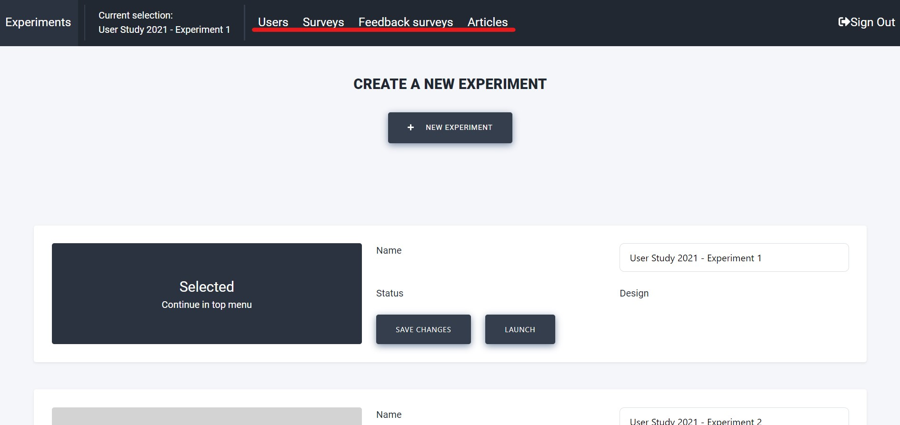

# Experiment Setup

Launching an experiment assumes you already have the apps published, the website launched, and the back end server running.
If this is not the case, please return to the [Installation Instructions](./install.md) and follow the tutorial step by step.

The following guidelines provide a detailed overview of how to set up and configure such experiments.
A sample experiment launching Informfully as a news recommendation platform will be used to guide through each of the experiment's phases.

::: info

Please see the [Experiment Overview](./overview.md) to get a high-level overview of how the components outlined below interact during a user experiment.


:::

## Create Experiment

The `Experiments` screen is where you manage your experiments.
You can create multiple experiments and run them simultaneously with completely separate participants and surveys.

To create a new experiment, click on the `NEW EXPERIMENT`-button.
An overlay with a form will appear, allowing you to enter a name for the new experiment.
After pressing `CREATE EXPERIMENT`, you will see the new experiment on the screen.
On the right, the name can be changed by editing the text field and clicking the `SAVE CHANGES`-button.

The initial experiment status is `DESIGN`.
At this stage, the administrator can add users, modify surveys, and experiment with the setup.
Once the status is switched to `LAUNCHED` by clicking the button, the experiment settings are locked to preserve the integrity of the results.

Select or deselect an experiment by clicking on the large button on the left.
Once an experiment has been selected, the tabs in the top menu bar are revealed (the menu may be hidden behind a menu icon on smaller screens).
The tabs in the top menu bar are described in the subsections below.




## Create Users

Once an experiment is selected in the `Experiments` screen, the participants of that experiment will be listed on the `Users` screen.
Find out more about [User Creation](./users.md).

If the experiment is new, new users can be added by pressing `ADD USERS`. 
Another module will appear with a form that allows the user amount and user group to be specified.
The user group can be any text to group participants (e.g., `baseline` and `experimental`).
After submitting, users should appear in the list immediately.
New users are created with randomly generated usernames and passwords.
The passwords can be accessed by exporting a CSV file by pressing the `CSV EXPORT`-button.
A download prompt will pop up.


Each individual user can be deleted by clicking the trash can on the right of the row.
We recommend exporting the user accounts as a CSV file and creating a backup copy.
(E.g., for support purposes, in case users forget their password.)


## Create Surveys

Informfully has a built-in [Survey Tool](./surveys.md).
It enables researchers to easily create and send surveys within a single, seamless interface.
Please read the above entry on the details and functionalities of this survey tool.

We do understand that not every use case will require a survey.
For this reason, user surveys are an optional component.
Researchers can skip this step because there is no requirement for getting user feedback.

In addition to prompting in-app surveys, researchers can add a custom rating below each item.
The screenshot below shows an overview of how to add these rating questions.
Each question can be answered with a thumbs-up or a thumbs-down.


Additionally, rating surveys/feedback can be defined as well (displayed above).
`Feedback Surveys`provides you with the option to formulate statements about a news article, which every participant will see in the mobile application, positioned immediately after the news article.
Participants can agree with (like) or disagree with (dislike) a statement.
The statements are the same for all the participants in an experiment.


## Scraper Pipeline

To create recommendations for users, you first need to have items to recommend.
The item format is specified in the [Database Collections](./database.md) (see 'newsArticles ', which serves as the item collection for the news aggregator use case in this online tutorial).

To populate this collection, we have provided a separate [Item Scraper](./scrapers.md).
Please read the documentation on deploying it.
The source code is available for download in the [Scrapers Repository](https://github.com/Informfully/Scrapers).


We recommend running the scrapers on the same server as the other parts of the back end.
There is no communication happening between the scraping modules and any other component of Informfully.
You can set the scraper up so that it writes directly to MongoDB's document collection, `newsArticles`/`itemCollection`.


## Recommender System

By default, all items in  `newsArticles`/`itemCollection` will be shown in chronological order.
However, there is an option to connect an external recommender system framework to the Informfully back end, allowing for ranked user recommendations.

To have users receive personalized recommendations, the collection [recommendationLists` (see `Database Collections](./database.md)) needs to be populated.
Below this paragraph is a reference implementation for creating recommendations for a single user.
(We advise using the official package for creating `ObjectId`-records).

```python

    from bson.objectid import ObjectId

    # A single article recommendation for a user
    def create_recommendation(user, article_id, prediction, algorithm_id, preview):

        recommendation = {
            "_id": ObjectId(),
            "userId": user,
            "articleId": article_id,
            "prediction": prediction,
            "recommendationAlgorithm": algorithm_id,
            "isPreview": preview,
            "createdAt": datetime.now()
        }

        return recommendation

```
::: info

We provide an in-depth [recommendation list tutorial](./recommendations.md) on how to connect your recommender framework to the Informfully back end, along with the [relevant code](https://github.com/Informfully/Documentation/tree/main/sample).

:::

The implementation of the recommendation list is framework-agnostic.
All that is needed is to write this data to `recommendationLists` in MongoDB.
Researchers can put this behind their own API, or they can run the recommender system on the same back end server as the other components of Informfully (thus directly writing to the database).

This step then concludes the setup of the user experiment.
Once you have completed this, the Informfully instance is ready to host and launch user experiments.

Once you have completed this setup, your Informfully instance is ready to host and launch user experiments.
Please refer to the [Experiment Overview](./overview.md) to see how these components interact with each other across the different experimental phases.


## Dataset Example

Visit the [Informfully Datasets Repository](https://github.com/Informfully/Datasets) for getting access to the data, and please see the [relevant database documentation](./database.md) for the technical documentation of all collections.
Below, you will find a quick overview of the dataset, including: A) daily active users, B) daily interactions, C) topic overview, and D) word-length distribution of news articles (referenced via URLs only).


