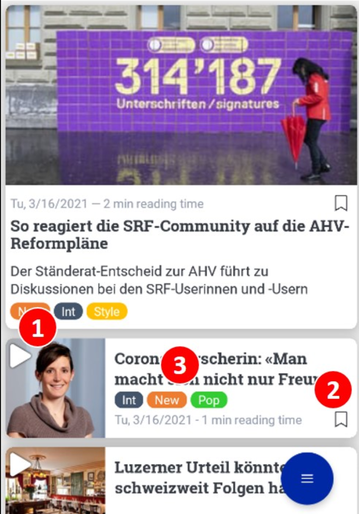

Explanations within Informfully are available as tags below item
recommendations.

{width="350px"}

1.  Tags for highlightes items.
2.  Tags for regular items.
3.  Note that tags can be defined deperately for each user-item pair.

> Please see `experiments`, `explanations`, and `explanationViews` in
> the [Database Documentation](https://github.com/Informfully/Database)
> on how to set up explanations for your experiment.
