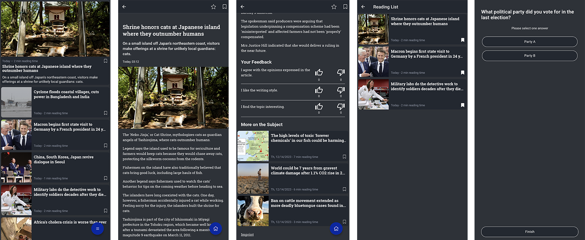

# Informfully


Welcome to [Informfully](https://informfully.ch/)!
Informfully is an open-source reproducibility platform for content distribution and conducting user experiments.

This is the combined and official Informfully Documentation for all [code repositories](https://github.com/orgs/Informfully/repositories).
For a tutorial on how to use Informfully, start with the [install](./install.md) section and the [installation](./install.md) instructions of the project.

**Links and Resources:** [GitHub](https://github.com/orgs/Informfully) | [Website](https://informfully.ch) | [X](https://x.com/informfully) | [DDIS@UZH](https://www.ifi.uzh.ch/en/ddis.html) | [Google Play](https://play.google.com/store/apps/details?id=ch.uzh.ifi.news) | [App Store](https://apps.apple.com/us/app/informfully/id1460234202)

::: info

There are two different ways that you can use Informfully: 
1) Use the front end and back end deployed by the University of Zurich or 
2) Deploy the whole application on your own.
The upcoming tutorial focuses on the self-hosted deployment of Informfully.
If you want to use the Informfully Platform as a cloud service, hosted at the University of Zurich, please reach out to us: info@informfully.ch

:::

## Overview



The Informfully platform allows you to push algorithmically curated text, image, audio, and video content to users and automatically generates a detailed log of their consumption history.
It is a domain-agnostic, platform-independent solution that fits your specific needs.
The platform was designed to accommodate different experiment types through versatility, ease of use, and scalability.
It features three core components: 

* a front end for displaying and interacting with recommended items, 
* a back end for researchers to create and maintain user experiments, and 
* a simple JSON-based exchange format (JREX) for ranked item recommendations to interface with third-party services.

## Architecture


Informfully features a fully modular design.
The app/web interfaces, content scrapers, recommender systems, and any other components listed in this documentation can be used together or in a standalone fashion.
There is no dependency across these components, as they communicate exclusively via shared document collections.
This documentation provides all the information you need to successfully configure Informfully, either as a whole or individually.
It is structured as follows:

* **Getting Started** serves as an overall introduction for installing the codebase, creating a development environment, and notes on the platform deployment.
* **Managing Experiments** provides an in-depth overview of how to use the Informfully platform to conduct user studies.
* **Recommender System** provides a tutorial on how to use the built-in Informfully recommender framework.
* **Technical Documentation** provides insights for various technical aspects in order to customize and extend the platform.


## Citation

If you use any Informfully code/repository in a scientific publication, we ask you to cite the following papers:

* [Informfully Recommenders – Reproducibility Framework for Diversity-aware Intra-session Recommendations](https://doi.org/10.1145/3705328.3748148), Heitz *et al.*, Proceedings of the 19th ACM Conference on Recommender Systems, 2025.

```console

   @inproceedings{heitz2025recommenders,
      title={Informfully Recommenders – Reproducibility Framework for Diversity-aware Intra-session Recommendations},
     author={Heitz, Lucien and Li, Runze and Inel, Oana and Bernstein, Abraham},
     booktitle={Proceedings of the 19th ACM Conference on Recommender Systems},
     pages={792--801},
     year={2025},
     publisher={ACM New York, NY, USA},
     url={https://doi.org/10.1145/3705328.3748148}
   }

```
* [Informfully - Research Platform for Reproducible User Studies](https://dl.acm.org/doi/10.1145/3640457.3688066), Heitz *et al.*, Proceedings of the 18th ACM Conference on Recommender Systems, 2024.

```console

   @inproceedings{heitz2024informfully,
      title={Informfully - Research Platform for Reproducible User Studies},
      author={Heitz, Lucien and Croci, Julian A and Sachdeva, Madhav and Bernstein, Abraham},
      booktitle={Proceedings of the 18th ACM Conference on Recommender Systems},
      pages={660--669},
      year={2024},
      publisher={ACM New York, NY, USA},
      url={https://doi.org/10.1145/3640457.3688066}
  }

```
## Support

You are welcome to contribute to the Informfully ecosystem and become a part of the community. Feel free to:

* fork any of the [Informfully repositories](https://github.com/Informfully/Documentation) and
* make changes and create pull requests.

Please post your feature requests and bug reports in our [GitHub issues](https://github.com/Informfully/Documentation/issues) section.

## License

Released under the [MIT License](https://github.com/Informfully/Documentation/blob/main/LICENSE). (Please note that the respective copyright licenses of third-party libraries and dependencies apply.)


