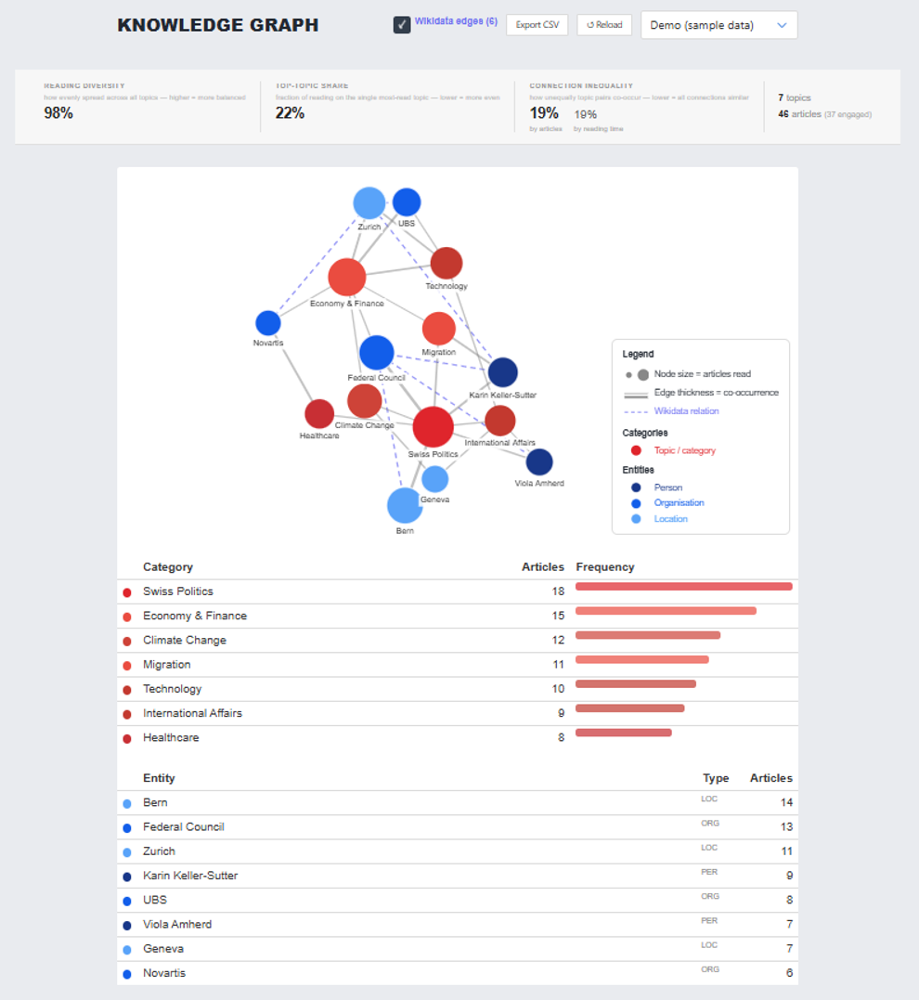

# User Behavior Knowledge Graph

To give researchers insight into individual participants' reading behavior beyond raw numbers, the researcher admin dashboard includes a knowledge-graph visualization. For each participant, the graph maps their reading history as a network of **topics** and **named entities** (persons, organizations, locations).

::: info
The dropdown in the top-right of the screenshot reads "Demo (sample data)" — it's not clear from this screenshot alone whether that's the only data source currently wired up, or one option among others (e.g. a real per-experiment/participant selector). Confirm before documenting this as working against live participant data.
:::

## Graph Structure (as described in the report)

* Topics are shown as red circles, named entities as blue circles (darker shades distinguish persons from organizations/locations).
* Node size reflects how many articles featuring that topic/entity the participant has read.
* Edge thickness between two nodes reflects how often they co-occur across those articles.

## Wikidata Enrichment

Named entities are resolved to Wikidata Q-IDs, and pairs of entities are checked for shared properties (e.g. shared country, occupation, political party, industry, employer); matching pairs get an additional dashed edge annotated with the relation label. Location entities are further linked to topic nodes when Wikidata identifies the location as being within a country/region matching a topic in the graph.

## Reading Diversity Metrics

Alongside the graph, a metrics bar summarizes a participant's reading diversity for the current week across three measures:

* **Reading diversity** — Shannon entropy over the distribution of articles read per topic, normalized by `log k` (k = number of distinct topics read), giving a score from 0 (all reading concentrated on one topic) to 1 (perfectly even across topics).
* **Top-topic share** — the fraction of articles read belonging to the single most-read topic; lower means more evenly spread reading.
* **Connection inequality** — the Gini coefficient applied to the distribution of edge weights (co-occurrence counts); 0 means all topic pairs co-occur equally, 1 means all co-occurrence is concentrated on a single pair.

Researchers can export these metrics for all participants and all weeks as a CSV file.

## Status

This is described in the report as an initial/preliminary implementation, with further extensions expected. Treat it as such: verify against the actual code before relying on any detail on this page for development work.
