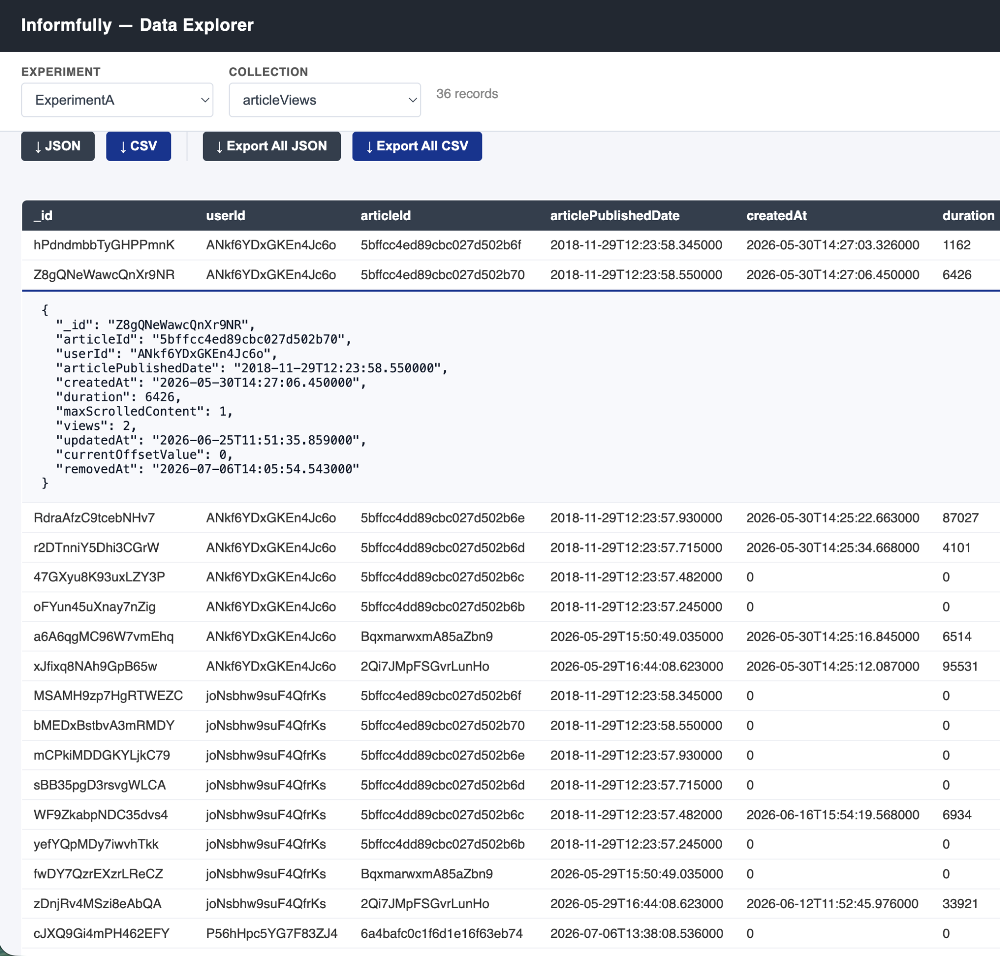

# Researcher Data API

Researchers running studies need programmatic access to the behavioral data their experiments produce — reading article views, page views, sign-ins, and so on — and they need to upload content such as news articles and recommendation lists from their own pipelines. Giving researchers direct database access is neither safe nor scoped, so this is exposed through a separate service instead: a Python **FastAPI** app (`fastapi_app/`) that shares the platform's MongoDB with the Meteor backend.

It runs as its own container (`fastapi`) in the Docker Compose stack — see [Docker Setup](./docker.md) — on port `8000`.

## Authentication Bridge

The API does not manage its own accounts; it reuses the platform's Meteor account system through a signed-token bridge:

1. A logged-in Meteor user who holds the `admin` or `maintainer` role calls the `apiAuth.issueToken` method (see [Meteor Methods](./methods.md#apiauth)).
2. Meteor signs a JWT (HS256) containing the user's id (`sub`) and roles, with a fixed issuer/audience and a 10-minute default lifetime (configurable via `API_JWT_TTL_SECONDS`).
3. The client sends that token to the FastAPI service as a standard `Authorization: Bearer <token>` header.
4. FastAPI validates it (`app/auth.py`) using the **same shared secret**, passed to both containers via the `API_JWT_SECRET` environment variable.

The two services never talk to each other directly — the only contract between them is the signed token — which keeps the API stateless and avoids duplicating account management in Python. Every protected route requires the token to carry the `admin` or `maintainer` role; the `POST /articles` route additionally requires `maintainer` specifically.

## Ownership Enforcement

Every data route first resolves which experiments the calling researcher owns (`app/ownership.py`, reading the `experiments` array on their `users` document) and refuses access to anything outside that set (`require_experiment_ownership`, HTTP 403). Uploading recommendations additionally checks that every referenced participant (`userID`) actually belongs to the target experiment, which prevents a researcher from writing data against another study's participants or probing for valid user ids.

## Routes

All routes below (except `/health`, `/ui/stats`, and the code-exchange endpoints) require a valid bearer token.

| Method | Path | Description |
| --- | --- | --- |
| GET | `/health` | Unauthenticated health check. |
| GET | `/experiments` | List experiments owned by the caller. |
| GET | `/experiments/{experiment_id}` | Read one owned experiment. |
| POST | `/articles` | Bulk-insert news articles (maintainer role required). |
| POST | `/experiments/{experiment_id}/recommendations` | Upload JREX-structured recommendations; validates every `userID` belongs to the experiment. |
| GET | `/experiments/{experiment_id}/recommendations` | List recommendations for an experiment's participants. |
| POST | `/experiments/{experiment_id}/articles` | Upload an experiment-scoped document into the `articles` collection. |
| GET | `/experiments/{experiment_id}/articles` | List that experiment's `articles` documents. |
| POST | `/experiments/{experiment_id}/test-artifacts` | Upload into the `fastapiTestArtifacts` collection (a scratch/example collection for testing the upload flow). |
| GET | `/experiments/{experiment_id}/test-artifacts` | List that experiment's test artifacts. |
| GET | `/experiments/{experiment_id}/user-behavior/{collection}` | Generic behavioral-data read for any allowlisted collection (see below). |
| GET | `/experiments/{experiment_id}/stats` | Per-collection document counts for an experiment, across all allowlisted collections. |
| POST | `/auth/code` | Exchange a valid bearer token for a single-use, 30-second UI code (see Data Explorer below). |
| POST | `/auth/exchange` | Exchange a UI code back for the JWT (single-use; deleted on use or expiry). |
| GET | `/ui/stats` | Serves the Data Explorer's HTML page. |

Interactive OpenAPI docs are available at `/docs` (Swagger UI) and `/redoc`, auto-generated by FastAPI from the route definitions above — useful for exact request/response schemas beyond this table.

`GET /experiments/{experiment_id}/user-behavior/{collection}` (and the Data Explorer built on top of it) has no pagination, date range, or other filtering — each call returns the *entire* result set for the experiment in one response. Expect slow responses when pulling a large collection from a long-running study.

## Exposing a New Collection (for Future Teams)

The service keeps an explicit allowlist of queryable collections in `fastapi_app/app/main.py`, split by how they're scoped:

* **User-scoped** (`USER_SCOPED_COLLECTIONS`) — documents keyed by `userId`; the API resolves the experiment's participant list and queries `userId $in [...]`. Currently: `articleViews`, `articleViewsUpgrade`, `pageViews`, `pageViewsUpgrade`, `signins`, `signInUpgrade`, `explanations`, `explanationViews`, `podcastAnalytics`, `videoAnalytics`, `wrappedReports`.
* **Experiment-scoped** (`EXPERIMENT_SCOPED_COLLECTIONS`) — documents keyed directly by `experimentId`. Currently: `scheduledEvents`, `recurringSchedules`.

To make a new collection queryable, add its name to the matching set. The generic `/user-behavior/{collection}` route, the `/stats` counts endpoint, and (per the report) the Data Explorer and export-all feature all pick it up automatically — no new endpoint code required. The only requirement is that the collection consistently carries either a `userId` or an `experimentId` field.

## Data Explorer

A single-page UI (served at `GET /ui/stats`, `fastapi_app/app/stats_ui.html`) lets a researcher inspect an experiment's collected data without leaving the browser. To keep the JWT out of places it shouldn't be logged (URLs, browser history), the link-through uses a one-time code:

1. The client already holds a valid JWT and calls `POST /auth/code` (Bearer-authenticated) to get back a random, single-use `code` valid for 30 seconds.
2. It opens the explorer with only that code in the URL.
3. The explorer immediately calls `POST /auth/exchange` with the code, gets the JWT back, and discards the code (server-side, it's deleted from the in-memory store on first use or once expired).
4. From then on, the JWT travels in the `Authorization` header rather than the URL.

Once authenticated, the explorer lets a researcher pick an owned experiment, see per-collection document counts (`GET /experiments/{id}/stats`), browse a collection's rows in a table with any cell openable as full JSON, and export data as JSON or CSV — either a single collection (`btn-csv`/`btn-json` in `stats_ui.html`) or every allowlisted collection at once (`Export All JSON`/`Export All CSV`).

