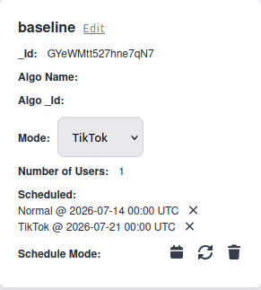
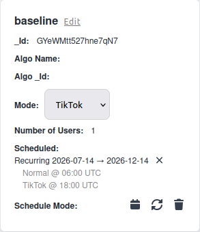

# Experiment Scheduling and Live Feed-Mode Control

The app offers two feed modes: the list-based **Normal** mode and the swipe-based **TikTok** mode. From the admin website you can:

* assign different participant groups to different modes,
* change a group's mode *while the app is running* — the switch reaches every participant in that group within seconds, with no reinstall or restart, and
* plan mode switches ahead of time instead of flipping them by hand at awkward hours (e.g. "group A switches to TikTok every day at 07:00").

## One-Off and Recurring Switches

You can schedule two kinds of mode switch:

* **One-off** — a single switch at a specific date and time.
* **Recurring** — a daily pattern over a date range, e.g. Normal mode from midnight and TikTok mode from 07:00 each day.

::: info
All times are interpreted in **UTC**, so a scheduled switch happens at the same absolute moment regardless of where participants are located.
:::

## Creating and Managing Schedules

You create one-off and recurring schedules from the user-group admin page, see a list of upcoming switches with their status, and can cancel them. Cancelling a recurring schedule cancels its still-pending switches but keeps the ones that already happened on the record.
