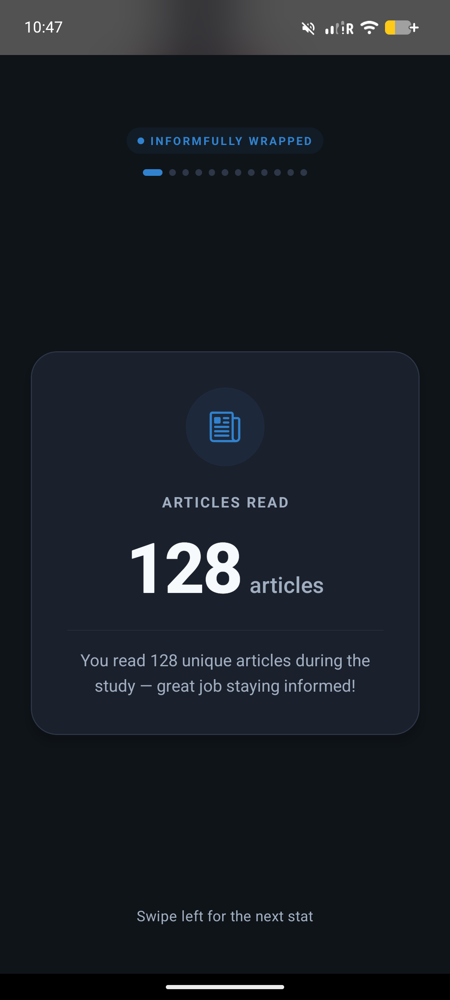
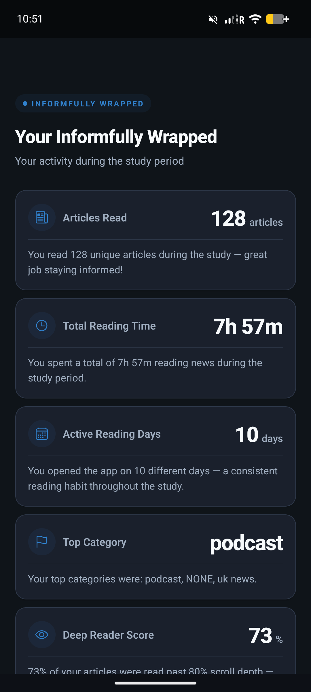
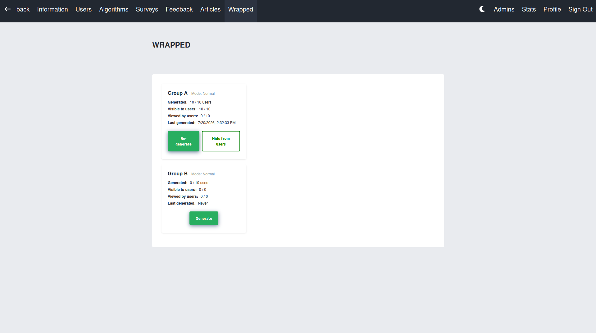

# Informfully Wrapped

Informfully Wrapped serves two research purposes at once. It gives participants a personal recap of their own reading behavior, in the style of the annual summaries popularized by music-streaming apps such as Spotify Wrapped, and it lets researchers push such a recap to selected participants *during* an experiment, to study whether prompting self-reflection changes how people read.

## App View

A banner appears on the home screen when a participant has a released Wrapped recap available:

Opening it shows a full-screen, story-style summary of the participant's reading behavior. The recap works in both feed modes: in TikTok mode each statistic is shown on its own swipeable card, while in Normal mode they appear as a single list.

## What the Recap Contains

A recap summarizes a participant's activity over the experiment, including:

* how many articles they read, how long they spent reading, and how many sessions they had,
* how many articles they saved or archived, and how many they liked or disliked,
* their top three news categories, their most active hour and day of the week, and how varied their reading was,
* a "deep reader" score reflecting how often they read articles all the way through.

Each time you generate a recap, a new report is created rather than overwriting the previous one, so you can see how a participant's statistics evolved over the course of a study.

## Releasing Recaps

A recap stays hidden from the participant until you release it. You can generate and release recaps for a single participant or for a whole experiment at once. Once released, the participant sees their most recent recap; earlier ones are superseded. Participants only ever see their own recap, and only after it has been released — and only the researcher who owns an experiment can generate or release recaps for it.

## Researcher Interface

Researchers drive Wrapped from a dashboard page where they generate reports per participant or for a whole experiment, toggle visibility individually or in bulk, and see each participant's current state:

